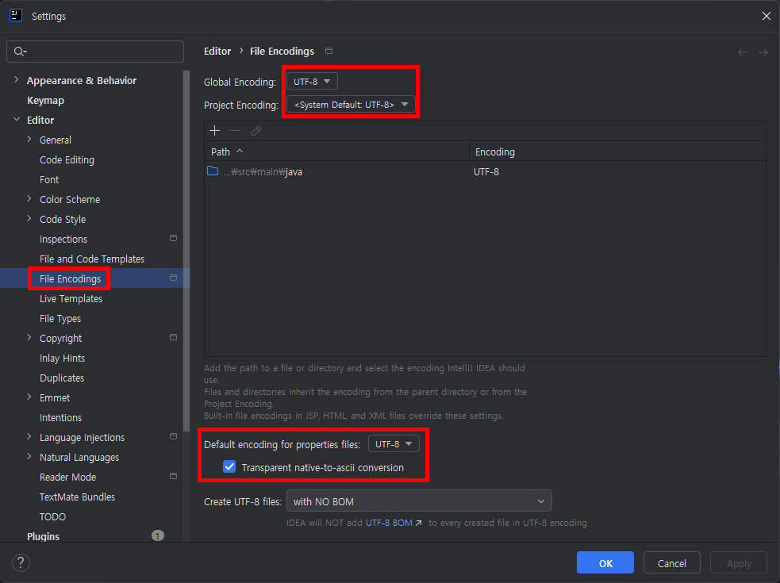

# 최초 IntelliJ 실행시 언어설정부터 해주세요.



# maven jar Build 및 배포 방법
1. Maven Lifecycle : clean -> package

2. scp 이용해서 AWS 루트 디렉토리에 jar 파일 copy
    ````
    scp -r -i (pem파일경로) (jar파일 경로) ubuntu@(ip주소):~/
    ````
3. AWS 우분투 접속해서 백그라운드 실행
    ```
   ssh -i (pem파일경로) ubuntu@(ip주소)
   
   screen -ls            # 실행 중인 screen 세션 목록 확인
    screen -r genieq      # 'genieq' 라는 기존 세션으로 다시 접속
   [ ctrl + c ]          # 실행 중인 애플리케이션을 Ctrl+C로 종료
   
   java -Duser.timezone=UTC -jar genieq-0.0.1-SNAPSHOT.jar   # 새 JAR 파일로 애플리케이션 다시 실행, timezone 오류로 직접 설정해서 실행
   
   [ Ctrl + A ] -> D     # 눌러 세션 분리
   ```
